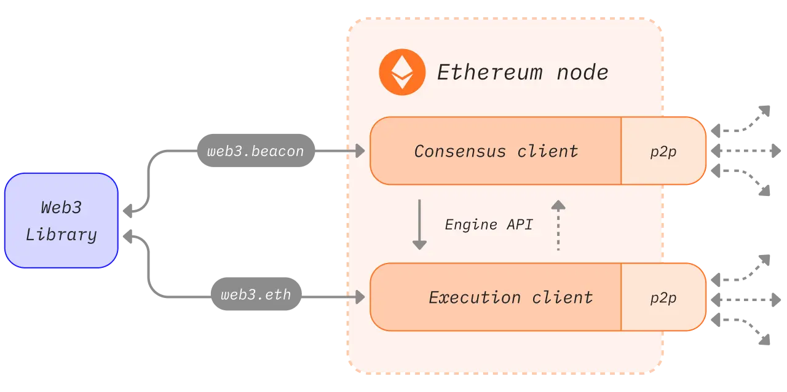
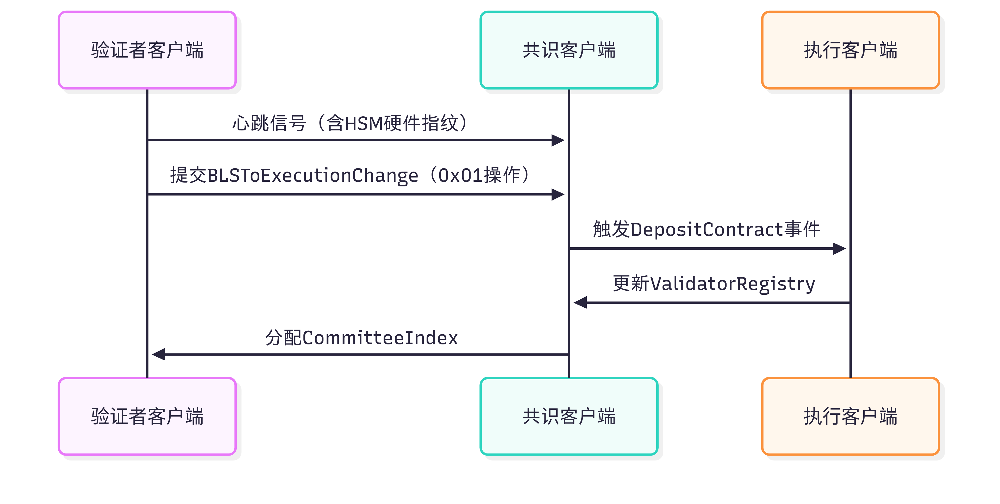
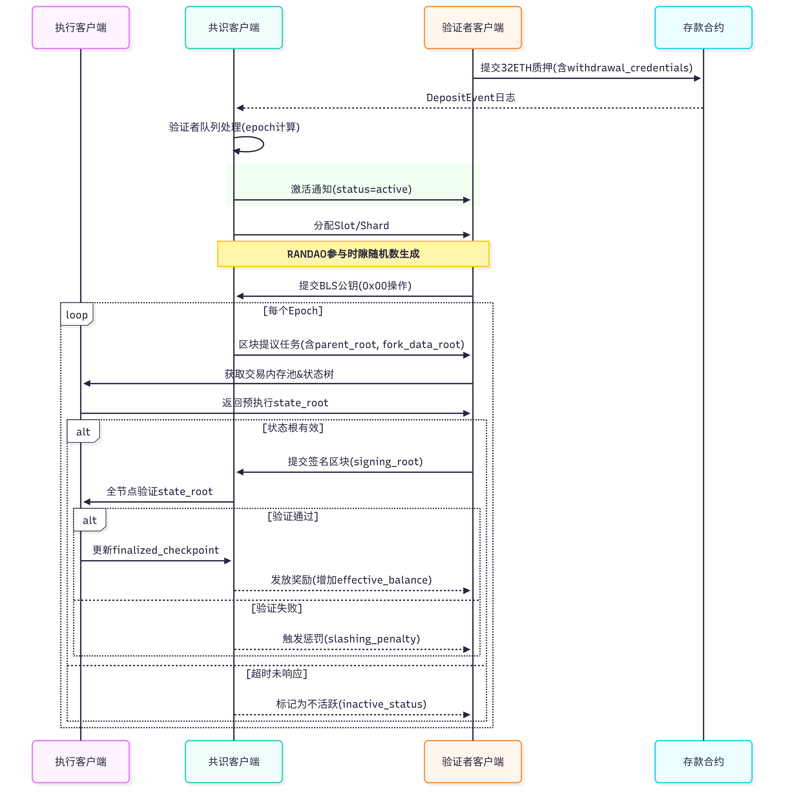

# 节点和客户端

“节点”是指任何以太坊客户端软件的实例，它连接到其他也运行以太坊软件的计算机，形成一个网络。 客户端是以太坊的实现，它根据协议规则验证数据并保持网络安全。 一个节点需要运行两种客户端软件：共识客户端和执行客户端。

* 执行客户端侦听网络中广播的新交易，并在以太坊虚拟机中执行它们，并保存所有当前以太坊数据的最新状态和数据库。
* 共识客户端实现权益证明共识算法，使网络能够根据来自执行客户端的经验证数据达成一致。 
   - 还有“验证者”客户端，可被集成到共识客户端中，使节点能参与保护网络安全。

## 执行客户端

参考 [执行客户端](https://ethereum.org/zh/developers/docs/nodes-and-clients/#execution-clients)
比较流行的有 Go-Ethereum，Besu

### 功能说明
- 📦 交易执行广播 处理所有交易、部署/调用智能合约。
- 📚 状态管理 维护账户余额、存储状态（State）、合约状态等。
- ⛓ 区块构建 构造和传播区块（但从合并后不再负责最终共识）。
- 🧾 JSON-RPC API 提供 web3, eth, net 等接口供外部调用（如 DApps、钱包）。
- 📁 数据存储 保存区块链数据，如区块、交易、状态树等。

🔄 与共识层交互：
- 接收来自共识客户端的出块请求（via Engine API）。
- 返回构建好的 block payload。
- 验证 block 后返回结果给共识客户端。

## 共识客户端

参考 [共识客户端](https://ethereum.org/zh/developers/docs/nodes-and-clients/#consensus-clients)
比较流行的有 Lighthouse, Prysm

### 功能说明
- 🧑‍⚖️ 区块共识：参与 PoS 共识（投票、提议、证明），决定哪个区块被接受。
- 🕒 时间管理：管理 slot/epoch（每 12 秒一个 slot）以推动网络共识节奏。
- 📬 区块提议：当自己成为 proposer 时，请执行层生成区块内容。
- ✅ 区块验证：验证所有接收到的区块内容是否正确并签名确认。
- 📊 最终性确认：跟踪哪些区块被视为“最终确定”不可回滚。

🔗 与执行层交互：
- 通过 Engine API 请求执行客户端构建或验证区块。
- 提供验证者服务，连接验证者客户端（或集成验证者模块）。

### 集成验证者
#### 验证者激活流程

验证者客户端满足激活条件：
- 32 ETH质押完成
- 退出队列有空位
- 通过健康检查（至少3个epoch）

## 执行客户端和共识客户端如何协同工作
[参考官方文档](https://ethereum.org/zh/developers/docs/consensus-mechanisms/pos/#transaction-execution-ethereum-pos)，一个交易从发送到被区块包含，需要经历以下步骤：

### 交易执行广播流程：

1. 用户使用他们的私钥创建并签署交易。 这通常由钱包或库处理，但本质上是用户在使用以太坊 JSON-RPC 应用程序接口向节点发出请求。用户定义他们准备支付一定量的燃料作为给验证者的小费，以鼓励他们将交易纳入在一个区块中。 小费支付给验证者，而基础费被销毁。
2. 交易被提交给以太坊执行客户端验证有效性。 这意味着确保发送人有足够的以太币来完成交易，并且他们已经使用正确的密钥来签名交易。
3. 如果交易有效，执行客户端将其添加到其本地内存池（待处理交易列表），并通过执行层广播网络将其广播到其他节点。 当其他节点听到关于交易的消息时，它们也将其添加到本地内存池中。高级用户可能会避免广播他们的交易，而是将其转发给专门的区块构建器，例如 Flashbots Auctionopens in a new tab。 这使他们能够在即将到来的区块中组织交易以获得最大利润（最大可提取价值）。

### 产块流程：
共识客户端在某个时间点被选为Proposer提案者，**提案者资格条件**:
   - 运行中的共识客户端必须集成已验证的验证者客户端
   - 验证者需满足, 有效质押, 通过epoch健康检查等条件
   - 通过RANDAO随机算法当`validator.client == consensus.client`

Proposer 产块流程：
- 网络上的验证节点之一是当前时隙的区块提议者，该节点负责构建和广播下一个要添加到以太坊区块链的区块并更新全局状态。 该节点由三部分组成：执行客户端、共识客户端和验证者客户端。 执行客户端将来自本地内存池的交易捆绑到“执行负载”中，并在本地执行它们以生成状态更改。 此信息被传递到共识客户端。在该客户端，执行有效载荷被包装为“信标区块”的一部分。该信标区块还包含有关奖励、惩罚、罚没、认证等的信息，从而使网络能够就链头的区块顺序达成一致。 
- 其他节点在共识层广播网络上接收新的信标区块，并将其传递给它们的执行客户端。在执行客户端上，交易在本地重新执行以确保提议的状态更改有效。 然后，集成验证者客户端的共识客户端参与投票证明，之后根据分叉选择规则，将该区块添加到本地数据库中。
- 如果一笔交易已经成为两个检查点之间具有“绝对多数链接”的链的一部分，那么可以认为该交易已经“最终确定”。 检查点发生在每个时段的开始，并且它们的存在是为了考虑到只有活跃验证者的子集在每个时隙中提供证明，但所有活跃验证者在每个时段内都会提供证明。 因此，只有在时段之间才能证明“超过半数链接”（这是指网络上总质押以太币的 66％ 同意两个检查点的情况）。

#### 验证者参与认证流程

不同客户端的对比
| 比较项         | 执行客户端                                                                 | 共识客户端                                                                 | 验证者客户端                                                                 |
|----------------|--------------------------------------------------------------------------|----------------------------------------------------------------------------|--------------------------------------------------------------------------|
| **核心功能**   | • EVM字节码执行 • Gas计量 • 状态树维护                             | • BLS签名验证 • 分片数据可用性证明 • 随机数生成(RANDAO)               | • 区块提议签名 • 见证聚合 • 双重签名检测                           |
| **网络协议**   | Engine API (JSON-RPC 2.0) • 请求/响应模式                             | libp2p/gossipsub 1.0 • 发布/订阅模式 • 消息主题：/eth2/beacon_chain/ | mTLS 1.3 • 双向认证 • 会话密钥轮换(每epoch)                       |
| **数据处理**   | 1. 接收原始交易 2. 构建交易树 3. 生成收据树                        | 1. 收集见证 2. 聚合签名(SNARKs) 3. 分片数据重组                     | 1. 接收职责分配 2. 本地签名(HSM) 3. 提交签名对象                   |
| **关键接口**   | eth_sendRawTransaction eth_getBlockByNumber                           | beacon_getBlock beacon_streamBlocks                                     | signer_signProposal signer_signAttestation                           |
| **同步机制**   | 无状态同步 • 按区块同步 • 增量式状态验证                           | 时隙同步 • 12秒周期 • NTP时间校准(±500ms)                            | Epoch同步 • 6.4分钟周期 • 纪元过渡检查(32 slots)                  |

**术语说明**:
- **分片数据可用性证明**: 基于KZG承诺的数据可用性抽样
- **mTLS**: 双向TLS认证，要求客户端和服务器交换证书
- **HSM**: 硬件安全模块，用于隔离签名操作

### 客户端之间通信保障机制
1. **双向认证体系**
   - 传输层：JWT-HMAC-SHA256认证（含密钥自动轮换）
   - 应用层：BLS签名验证（基于验证者私钥）
2. **状态验证闭环**
   - 执行层验证父区块状态根（通过`eth_getBlockByNumber`）
   - 共识层验证区块哈希有效性（通过`engine_newPayloadV1`）
3. **防篡改设计**
   - 签名包含区块哈希+状态根（双重绑定）
   - 执行payload附带GasUsed验证（防止资源滥用）

 
### 验证机制对比
共识和执行客户端都涉及对区块的验证，但具体验证机制和触发时机有差异。

| 验证维度       | 执行客户端 (Execution Client)                | 共识客户端 (Consensus Client)          | 验证者客户端 (Validator Client)       |
|----------------|---------------------------------------------|----------------------------------------|----------------------------------------|
| 核心职责       | 交易有效性验证（签名、Gas计算）             | 共识规则验证（BLS签名、委员会验证）    | PoS共识参与（区块提议/证明）          |
| 验证触发时机   | 交易池接收时预验证+区块执行时完整验证        | 仅在收到新区块时触发                   | 基于时隙（Slot）和委员会分配          |
| 状态访问       | 需要完整世界状态树                           | 仅需访问当前epoch的验证者集合          | 仅需本地保护私钥                      |
| 签名验证类型   | ECDSA                                       | BLS12-381                              | BLS12-381（主动签名）                 |
| 资源消耗       | 高CPU/内存（需执行所有交易）                 | 低CPU（仅验证聚合签名）                | 中等（签名生成+网络通信）             |
| 失败处理       | 丢弃无效交易                                 | 触发分叉选择规则更新                   | 触发罚没（Slashing）机制              |

ECDSA 和 BLS 算法对比
| 对比项         | ECDSA                                      | BLS12-381                              |
|----------------|---------------------------------------------|----------------------------------------|
| 密钥结构       | 单个公钥对应独立签名                        | 公钥可聚合，签名可组合                |
| 签名验证速度   | 单签快（~1ms）但批量验证慢                  | 单签慢（~10ms）但聚合验证快           |
| 聚合能力       | 不支持原生聚合                              | 支持任意数量签名聚合为单个证明         |
| 抗量子性       | 易受量子计算机攻击                          | 基于椭圆曲线对，具备后量子安全候选方案 |
| 标准化程度     | 广泛支持（比特币/以太坊 1.0）               | 新兴标准（以太坊 2.0+）                |

